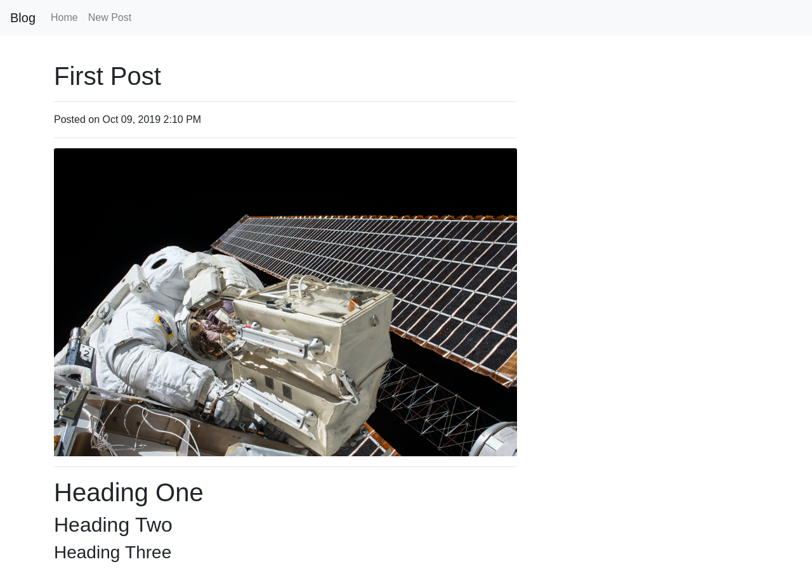
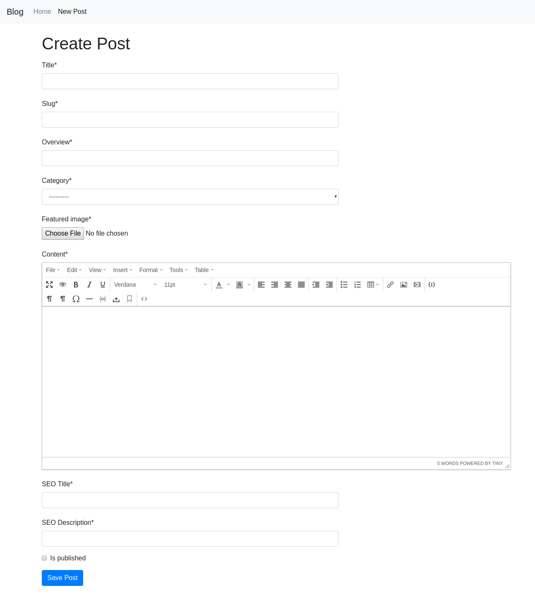

# Blog App  
This project uses the following:
- **Python** : 3.6.8
- **Postgres** : 10.10 


## Installation
- Make sure postgres is installed on your system, then change the postgres user credentials over [here](src/blog_task/blog_task/settings.py#L71) and database name over [here](src/blog_task/blog_task/settings.py#L70)
- Install the project dependencies using:
```
pip install -r requirements.txt
```

## Running
First change the current directory to the following [directory](src/blog_task) in your terminal, then start the server by running the command:
```
python manage.py runserver
```

## Screenshots
### Home Page


### Blog Post Page


### Create Post Page

