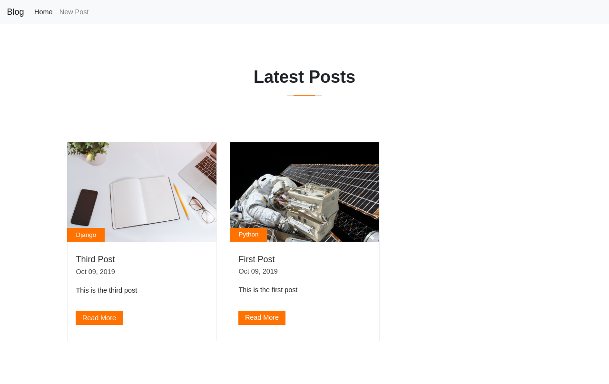

# Blog App  
This project was made using Python 3.

## Installation
Install the project dependencies using:
```
pip install -r requirements.txt
```

## Running
First change the current directory to the following [directory](src/blog_task) in your terminal, then start the server by running the command:
```
python manage.py runserver
```

## Screenshots
### Home Page


### Blog Post Page


### Create Post Page

